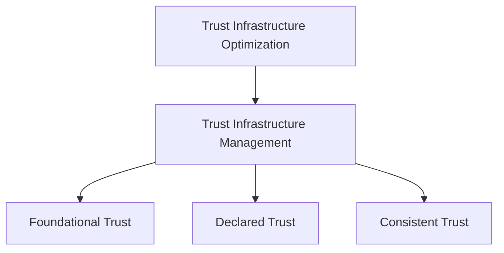

# XAIX Trust Infrastructure Optimization (TIO) Framework – v1.0

---

## Purpose

In today's digital world, it's easy to appear online — but harder to be trusted.  
People and systems alike now ask not just *what* you say, but *how* your identity and information are structured.  
That structure is what inspires trust.

The **XAIX TIO Framework** provides a clear, flexible model for designing that structure.  
It helps individuals, teams, and organizations align their digital presence with credibility, clarity, and consistency —  
so they can be not just seen, but truly trusted.

---

## Core Philosophy

- Trust is not random — it can be thoughtfully designed  
- Being seen is important, but being believed is essential  
- Structure supports credibility  
- Visibility and trust can work together, when designed with intention  
- What we can control — signals, structure, alignment — matters deeply

---

## Why Now?

The internet began as a way to share information, ideas, and research — grounded in openness and connection.  
As it has grown, so too has the need to distinguish appearance from substance, and strategy from sincerity.  
TIO is a framework to help reconnect visibility with credibility, and to guide organizations toward sustainable trust.

---

## What is TIO?

**Trust Infrastructure Optimization (TIO)**  
> A thoughtful strategy for helping search engines, AI systems, and people better understand and trust who you are —  
> by aligning what you control (your information, structure, and consistency) with what you represent.

TIO does not replace SEO or marketing.  
It complements them — helping ensure that **what’s visible is also structurally trustworthy**.

---

## What is TIM?

**Trust Infrastructure Management (TIM)**  
> The set of activities that help make TIO a reality — day to day.

These actions form a reliable foundation that supports trustworthiness at every layer.

---

## The 3 Pillars of TIM

### 1. Foundational Trust (FT)

> Strengthen the technical and structural base — such as your domain, delivery, and control environment.

### 2. Declared Trust (DT)

> Clearly express who you are, what you do, and how you wish to be understood — with clarity and care.

### 3. Consistent Trust (CT)

> Keep all your public information aligned — across platforms, over time, and across teams — to reduce confusion and build confidence.

---

## How to Use TIO

- As a guide to build long-term credibility online  
- As a design mindset for aligning structure with mission  
- As a tool for evaluating readiness to be trusted — not just seen  
- As a way to support AI, search, and users in understanding your trustworthiness

---

## On Authenticity

> TIO focuses on structuring how trust is presented.  
> While it does not judge internal operations, it works best when the **signals reflect real values and behavior**.  
> Trust that is both visible and sincere has the greatest chance to last — with people and with systems.

---

## Version & License

- Version: **1.0**
- First published: **June 21, 2025**

This framework was created and authored by **Tomoki Uemura**, founder of **XAIX**.  
Author contact: [uemura@xaix.jp](mailto:uemura@xaix.jp)  
General inquiries: [tio@xaix.jp](mailto:tio@xaix.jp)  
Repository: [https://github.com/xaixjp/tio-framework](https://github.com/xaixjp/tio-framework)

Use and reference are welcome with attribution to the official repository.  
Commercial reuse requires written permission.

© 2025 XAIX – All rights reserved.
