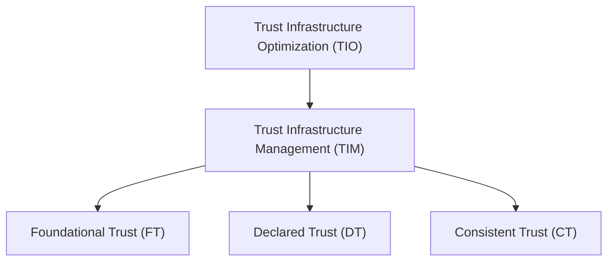
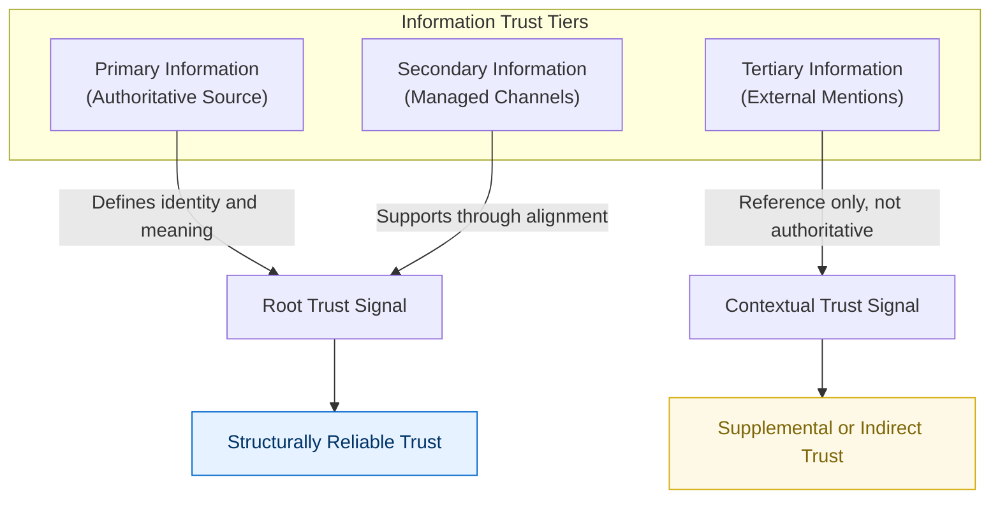

# XAIX Trust Infrastructure Optimization (TIO) Framework – v1.1

---

## Purpose

In today's digital world, it's easy to appear online — but harder to be trusted.  
People and systems alike now ask not just *what* you say, but *how* your identity and information are structured.  
That structure is what inspires trust.

The **XAIX TIO Framework** provides a clear, flexible model for designing that structure.  
It helps individuals, teams, and organizations align their digital presence with credibility, clarity, and consistency —  
so they can be not just seen, but truly trusted.

---

## Core Philosophy

- Trust is not random — it can be thoughtfully designed  
- Being seen is important, but being believed is essential  
- Structure supports credibility  
- Visibility and trust can work together, when designed with intention  
- What we can control — signals, structure, alignment — matters deeply

---

## Why Now?

The internet began as a way to share information, ideas, and research — grounded in openness and connection.  
As it has grown, so too has the need to distinguish appearance from substance, and strategy from sincerity.  
TIO is a framework to help reconnect visibility with credibility, and to guide organizations toward sustainable trust.

---

## What is TIO?

**Trust Infrastructure Optimization (TIO)**  
> A thoughtful strategy for helping search engines, AI systems, and people better understand and trust who you are —  
> by aligning what you control (your information, structure, and consistency) with what you represent.

TIO does not replace SEO or marketing.  
It complements them — helping ensure that **what’s visible is also structurally trustworthy**.

---

## What is TIM?

**Trust Infrastructure Management (TIM)**  
> The set of activities that help make TIO a reality — day to day.

These actions form a reliable foundation that supports trustworthiness at every layer.



---

## The 3 Pillars of TIM

### 1. Foundational Trust (FT)

> Strengthen the base of trust — not only through technical mechanisms,  
> but also through structured systems and processes that establish authenticity.

Foundational Trust rests on two core dimensions:

- **Systemic Technical Reliability**:  
  The structured mechanisms that ensure safe, verifiable delivery and consistency of your information online.

- **Institutional or Verified Recognition**:  
  Trust is also reinforced by systems that confirm identity or legitimacy through official — or officially comparable — verification processes.  
  These include steps that demonstrate your digital presence is tied to a real, accountable entity.

### 2. Declared Trust (DT)

> Clearly express who you are, what you do, and how you wish to be understood — with clarity and care.

Declared Trust involves presenting your identity, values, and capabilities in a way that is understandable to both people and machines.

TIO encourages that this declaration originate from a single authoritative source —  
a website or channel under your direct control — rather than being fragmented across multiple origins.

### 3. Consistent Trust (CT)

> Keep all your public information aligned — across platforms, over time, and across teams — to reduce confusion and build confidence.

Supporting consistency means managing the harmony between your declared identity and the public-facing content associated with you.  
The greater the alignment, the stronger the signal of reliability.

---

## Information Trust Tiers

To help distinguish what type of information supports trust and how it should be interpreted, TIO introduces a three-tier model:

- **Primary Information**  
  The original source of structured meaning, fully owned or directly authorized.  
  This is the only authoritative place where identity and intent are formally defined.

- **Secondary Information**  
  Channels under your control that support and reinforce primary declarations (e.g., official social accounts).  
  These should stay structurally aligned with your primary source.

- **Tertiary Information**  
  Information created or maintained by others — such as reviews, listings, or third-party summaries.  
  Even if accurate, they are not authoritative and should not be confused with your own declared meaning.

The distinction is not just about accuracy — it’s about control.  
Only what you can manage and define can serve as a true declaration of trust.



This tiered model also conceptually aligns with the three trust layers defined in TIM:

- **Primary Information** aligns with **Declared Trust (DT)**, as it represents the authoritative source of identity and intent — directly managed and intentionally structured.
- **Secondary Information** aligns with **Consistent Trust (CT)**, as it includes managed channels that must remain structurally in sync with the primary source.
- **Tertiary Information** does not directly correspond to any TIM layer, as it reflects external references beyond the scope of direct management or formal declaration.

Additionally, both Primary and Secondary Information rely on a foundation of **Foundational Trust (FT)** — the infrastructural and institutional credibility that makes trust declarations technically verifiable and contextually meaningful.

This alignment reinforces the idea that trust is not just a matter of accuracy or popularity, but of control, structure, and intentional alignment.

### On Structured Absence and Declared Non-Connection

In today’s information-saturated environment, silence is often misinterpreted.

TIO operates on the principle that **only what is explicitly declared from a primary source is considered trustworthy**.  
This includes not only what you say — but also what you choose not to do.

For individuals or organizations who prefer not to participate in certain channels (e.g., social media, review sites),  
it is critical to **declare that absence structurally**, from within your Primary Information.

Example declaration:

> “We do not operate any social media accounts.”  
> “We do not appear on third-party review sites.”  
> “Any information outside our official domain is not authorized.”

This type of negative declaration — when issued from a verifiable, authoritative source —  
**prevents third-party information from being mistaken as Primary**, and maintains the integrity of your trust structure.

Sometimes, **those who wish to say the least must still define the most.**  
Declaring absence is not exclusion — it's authorship.

### Implementation Note: Declared Absence in JSON-LD

In TIO, structuring your declared absence does not require complex configuration —
it simply means **intentionally limiting what appears in your structured data**.

Specifically:

- If you do not maintain any external channels (e.g., social media or review platforms),
  simply **omit the `sameAs` field entirely** from your JSON-LD.
- This absence is not an oversight — it is a structural signal indicating that no external profiles are part of your declared trust surface.
- You may also include a visible statement on your website clarifying your boundaries, such as:

```
<p>We do not participate in social media or review sites. Any information outside this domain is not authorized.</p>
```

You can also present this message in plain text anywhere on your website.

This minimalist approach is fully aligned with TIO's principles:
trust is defined not by what is inferred, but by what is explicitly declared — or deliberately left undeclared.

By omitting sameAs, you are not hiding information.
You are asserting a boundary — and declaring it through structure.

> **Structured absence is not omission. It is authorship by design.**

---

## How to Use TIO

- As a guide to build long-term credibility online  
- As a design mindset for aligning structure with mission  
- As a tool for evaluating readiness to be trusted — not just seen  
- As a way to support AI, search, and users in understanding your trustworthiness

---

## On Authenticity

> TIO focuses on structuring how trust is presented.  
> While it does not judge internal operations, it works best when the **signals reflect real values and behavior**.  
> Trust that is both visible and sincere has the greatest chance to last — with people and with systems.

---

## Version & License

- Version: **1.0**
- First published: **June 21, 2025**

- Version: **1.1**
- Updated: **June 24, 2025**

### Change Log (v1.1 – June 24, 2025)

- Revised descriptions for Foundational Trust (FT), Declared Trust (DT), and Consistent Trust (CT) to clarify scope of responsibility and target areas.
- Added a new section titled “Information Trust Tiers” as a supplementary framework to help contextualize the levels of trust maturity across the layers.
- Introduced the concept of **Declared Absence** through a new section, “On Structured Absence and Declared Non-Connection,”  
  outlining how the intentional omission of connections (e.g., social media or review sites) can serve as a trust signal when declared from a primary source.
- Added implementation guidance on **structured absence using JSON-LD**, including the practice of omitting the `sameAs` field to signal non-participation.


This framework was created and authored by **Tomoki Uemura**, founder of **XAIX**.  
Author contact: [uemura@xaix.jp](mailto:uemura@xaix.jp)  
General inquiries: [tio@xaix.jp](mailto:tio@xaix.jp)  
Repository: [https://github.com/xaixjp/tio-framework](https://github.com/xaixjp/tio-framework)

Use and reference are welcome with attribution to the official repository.  
Commercial reuse requires written permission.

© 2025 XAIX – All rights reserved.